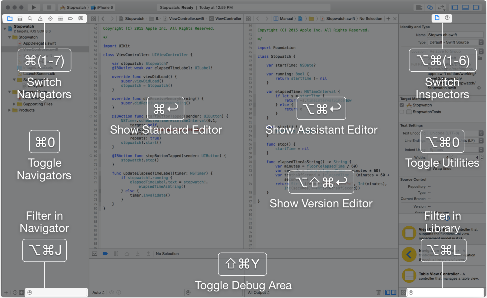

<table>
  <tr>
    <th>分类</th>
    <th>快捷键</td>
    <th>作用</td>
  </tr>

  <tr>
    <th rowspan="1">光标定位</th>
    <td>Ctrl + Cmd + ←/→</td>
    <td>跳转到上/下一个位置</td>
  </tr>

  <tr>
    <th rowspan="2">导航定位</th>
    <td>Cmd + Shift + J</td>
    <td>在导航栏定位当前打开文件</td>
  </tr>
  <tr>
    <td>Cmd + Shift + L</td>
    <td>打开 Object Library</td>
  </tr>

  <tr>
    <th rowspan="2">折叠</th>
    <td>Cmd + Alt + Shift + ←/→</td>
    <td>折叠/展开 全部</td>
  </tr>
  <tr>
    <td>Cmd + Alt + ←/→</td>
    <td>折叠/展开 当前函数</td>
  </tr>

  <tr>
    <th rowspan="9">Debug & Run</th>
    <td>Cmd + R</td>
    <td>编译运行</td>
  </tr>
  <tr>
    <td>Cmd + .</td>
    <td>停止</td>
  </tr>
  <tr>
    <td>Cmd + \</td>
    <td>在当前行添加/删除断点</td>
  </tr>
  <tr>
    <td>Cmd + Y</td>
    <td>启用/禁用所有断点</td>
  </tr>
  <tr>
    <td>F6</td>
    <td>Step Over</td>
  </tr>
  <tr>
    <td>F7</td>
    <td>Step Into</td>
  </tr>
  <tr>
    <td>F8</td>
    <td>Step Out</td>
  </tr>
  <tr>
    <td>Ctrl + Cmd + Y</td>
    <td>Continue</td>
  </tr>
  <tr>
    <td>Ctrl + Cmd + C</td>
    <td>Run to Current</td>
  </tr>

</table>