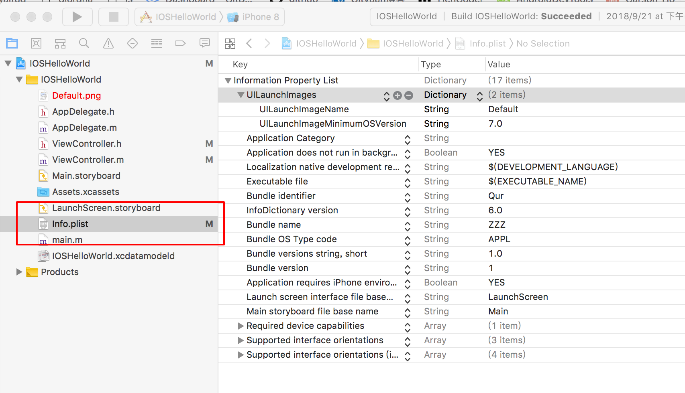

Info.plist 相当于 Android 中的 AndroidManifest.xml. 里面存放的是 app 的各项描述信息, 例如 Launcher 图标, 名字, 权限等等.

Info.plist 是 information property list 的缩写. 实际上是一个 *不含 BOM 的 utf-8 编码 xml 文件*. 不过这个 xml 文件比较特殊, 是按照数组的方式进行排列. 如下:

```xml
<?xml version="1.0" encoding="UTF-8"?>
<!DOCTYPE plist PUBLIC "-//Apple//DTD PLIST 1.0//EN" "http://www.apple.com/DTDs/PropertyList-1.0.dtd">
<plist version="1.0">
<dict>
	<key>CFBundleDevelopmentRegion</key>
	<string>$(DEVELOPMENT_LANGUAGE)</string>
	<key>UIMainStoryboardFile</key>
	<string>Main</string>

        ...

	<key>UIRequiredDeviceCapabilities</key>
	<array>
		<string>armv7</string>
	</array>
</dict>
</plist>

```

建议在 xCode 中选择该文件进行编辑, 如下图:



### 显示原始 Key
正常情况下, 在右侧 Key-Value 区域我们看到的是 Key 的描述, 而不是 xml 文件中真实的键名, 可以点击右键选择 "Show Raw Keys/Values" 来显示 Key 原有的名字. 如下图:


### 常见的几个属性

#### CFBundleIdentifier (String)
包名. 就是 AndroidManifest 里面的 package 一样. 不同的包名就是不同的 app.

#### CFBundleDisplayName (String)
这是显示到 Launcher 的名称. 同时供 Siri 识别.

#### CFBundleIconFiles (Array)
Launcher 的图标. 不过新的 xCode 都自带 icon 可视化配置了(点击 Assets.xcassets 出现), 这个选项适用场景比较小了.

#### UIMainStoryboardFile (String)
启动后加载的首页布局文件. 就相当于 "android.intent.category.LAUNCHER" 一样

#### UIRequiredDeviceCapabilities (Array/Dictionary)
运行所需要的权限. 类似 AndroidManifest 的 permission 节点. 我们再来看看常用的 permission:
* arm64: iPhone 5s 以后的都是这个架构了. 但是模拟器上是 armv7
* wifi
* video-camera: 摄像机
* microphone: 麦克风
* gps: 如果指定 gps, 也需要同时指定 location-services. 只有需要精确定位的情况下才需要 gps. 而普通定位优选 wifi 定位.
* magnetometer: 磁力仪. 分辨东南西北的.
* bluetooth-le: 蓝牙
* nfc
* telephony: 表示需要 Phone 这个 APP 存在
* sms: 表示需要 Message 这个 APP 存在

#### UIRequiresPersistentWiFi (Boolean)
默认情况下 APP 在 30 分钟后 wifi 就会自动断开(即便 APP 在运行中也如此). 如果想保持 wifi 链接, 需要将 `UIRequiresPersistentWiFi` 设置为 true

## Refs
[官方 Information Property List Key Reference](https://developer.apple.com/library/archive/documentation/General/Reference/InfoPlistKeyReference/Introduction/Introduction.html#//apple_ref/doc/uid/TP40009248-SW1)